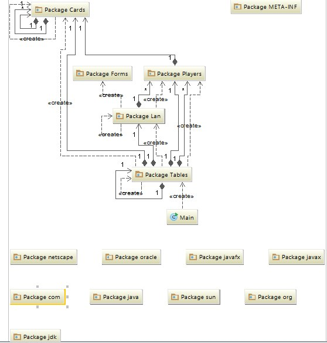

# Poker

## Description

Poker is an interactive gambling card game, designed for many players. There are lots of variations of the game, but for our program, we chose the most widespread version - 'Texas Hold'em'. This game has many followers and continues to gain more and more fans in all around the earth.
With our program, each user can feel a true poker player and experience the same feeling as when "playing live". There was also made version of "online play", as a version to play on different computers connected to the same network.
The project was implemented for each player to have a possibility to play with his friends. In the future web-design and mass production of the program will be made.

## Authors

Denis Drabchuk, Kolya Symotyuk, Nazar Nuzhnyk

## Class diagram

!
